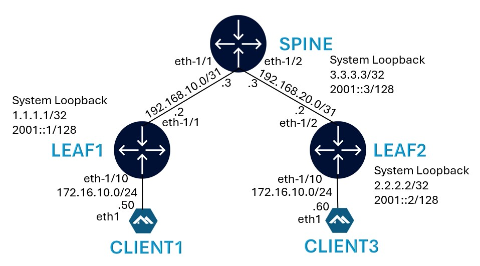

# Mastering gRPC-Based Services for Network Automation

Welcome to the workshop on *Mastering gRPC-based services for network auotmation* at Network Automation Forum's Autocon3.

This README is your starting point into the hands on section.

Pre-requisite: A laptop with SSH client

If you need help, please raise your hand and a Nokia team member will be happy to assist.

Shortcut links to major sections in this README:

| --- | --- |
| [Lab Topology]() | [Deploying the lab]() |
| [BGP Underay]() | [BGP Overlay]() |
| [Layer 2 EPVN]() | [Layer 3 EVPN]() |

## Lab Environment

A Nokia team member will provide you with a card that contains:
- your VM hostname
- SSH credentials to the VM instance
- URL of this repo

> <p style="color:red">!!! Make sure to backup any code, config, ... <u> offline (e.g on your laptop)</u>. 
> The VM instances will be destroyed once the Workshop is concluded.</p>

## Workshop
The objective of the hands on section of this workshop is the following:
- Configuring, retrieving state, streaming telemetry using gNMI
- File backup, restore and software upgrade prep using gNOI
- gRPC service authorization and certificate management using gNSI
- Traffic steering using gRIBI

## Lab Topology

Each workshop participant will be provided with the below topology consisting of 2 leaf and 1 spine nodes along with 4 clients. The Leaf-Spine architecture is typical in a Data Center environment and clients simulating workloads or VMs.


## NOS (Network Operating System)

Both leafs and Spine nodes will be running the latest release (25.3.1) of Nokia [SR Linux](https://www.nokia.com/networks/ip-networks/service-router-linux-NOS/).

All 4 clients will be running [Alpine Linux](https://alpinelinux.org/)

See the [topology](ac3-grpc.clab.yml) file for more details.

## Deploying the lab

Login to the VM using the credentials on your sheet.

This Git repo is already cloned to your VM.

But in case you need it, use the below command to clone this repo to your VM.

```
git clone https://github.com/srlinuxamericas/ac3-grpc.git
```

Verify that the git repo files are now available on your VM.

```
ls -lrt ac3-grpc/
```

To deploy the lab, run the following:

```
cd ac3-grpc
sudo clab deploy -t ac3-grpc.clab.yml
```

[Containerlab](https://containerlab.dev/) will deploy the lab and display a table with the list of nodes and their IPs.

```
+---+-----------------------+--------------+------------------------------+---------------+---------+-----------------+-----------------------+
| # |         Name          | Container ID |            Image             |     Kind      |  State  |  IPv4 Address   |     IPv6 Address      |
+---+-----------------------+--------------+------------------------------+---------------+---------+-----------------+-----------------------+
| 1 | clab-srl-evpn-client1 | 5d035710d740 | ghcr.io/srl-labs/alpine      | linux         | running | 172.20.20.10/24 | 2001:172:20:20::10/64 |
| 2 | clab-srl-evpn-client2 | b8eae8f0c316 | ghcr.io/srl-labs/alpine      | linux         | running | 172.20.20.11/24 | 2001:172:20:20::11/64 |
| 3 | clab-srl-evpn-client3 | 253b8a183d91 | ghcr.io/srl-labs/alpine      | linux         | running | 172.20.20.12/24 | 2001:172:20:20::12/64 |
| 4 | clab-srl-evpn-client4 | c686fbbce2b7 | ghcr.io/srl-labs/alpine      | linux         | running | 172.20.20.13/24 | 2001:172:20:20::13/64 |
| 5 | clab-srl-evpn-leaf1   | 50bddf973b6a | ghcr.io/nokia/srlinux:latest | nokia_srlinux | running | 172.20.20.2/24  | 2001:172:20:20::2/64  |
| 6 | clab-srl-evpn-leaf2   | 4b5b1ddb7f7b | ghcr.io/nokia/srlinux:latest | nokia_srlinux | running | 172.20.20.4/24  | 2001:172:20:20::4/64  |
| 7 | clab-srl-evpn-spine   | 04ff754b4085 | ghcr.io/nokia/srlinux:latest | nokia_srlinux | running | 172.20.20.3/24  | 2001:172:20:20::3/64  |
+---+-----------------------+--------------+------------------------------+---------------+---------+-----------------+-----------------------+
```

To display all deployed labs on your VM at any time, use:

```
sudo clab inspect --all
```

### Using Codespaces

This lab can be deployed using GitHub Codespaces. After clicking the below icon, wait for 2 minutes for codespaces to be ready. During this initialization, codespace will install containerlab and gRPC clients so that you are all set to run the use cases immediately.

---
<div align=center>
<a href="https://codespaces.new/srlinuxamericas/ac3-grpc?quickstart=1">
</a>

**[Run](https://codespaces.new/srlinuxamericas/ac3-grpc?quickstart=1) this lab in GitHub Codespaces for free**.  
[Learn more](https://containerlab.dev/manual/codespaces/) about Containerlab for Codespaces.

</div>

---

## Connecting to the devices

Find the nodename or IP address of the device from the above output and then use SSH.

Username: `admin`

Password: Refer to the provided sheet

```
ssh leaf1
```

To login to the client, identify the client hostname using the `sudo clab inspect --all` command above and then:

```
sudo docker exec –it client3 sh
```

### IPv4 Link Addressing



### IPv6 Link Addressing


### Verify reachability between devices

After the lab is deployed, check reachability between leaf and spine devices using ping.

Example on spine to Leaf1 for IPv4:

```
ping -c 3 192.168.10.2 network-instance default
```

Example on spine to Leaf1 for IPv6:

```
ping6 -c 3 192:168:10::2 network-instance default
```

## gRPC Clients

We will be using the following gRPC clients:

- [gNMIc](https://gnmic.openconfig.net/)
- [gNOIc](https://gnoic.kmrd.dev/)
- [gNSIc](https://github.com/karimra/gnsic)
- [gRIBIc](https://gribic.kmrd.dev/)

All 4 clients are installed when initializing the VM or codespace.

Verify that clients are installed:

```
gnmic version
gnoic version
gnsic version
gribic version
```

All gnmic, gnoic, gnsic and gribic commands will be executed from the VM.


## gNMI Use Cases

We will start by using gNMI to push configuration to all 3 switches.

The lab is deployed with minimum required startup configuration that enables gRPC services and creates the users.

After the lab is deployed, connect to either leafs or spine.

To list the current status of the interfaces on leafs or spine, use:

```
show interface
```

Only the management interface is currently configured.

Now, let's push the configuration to all 3 switches.

### gNMI Set

We will start with an example of updating a single config object.

<add>

#### gNMI with Openconfig

Next, we will use Openconfig models to configure BGP underlay, overlay and create a Layer 2 EVPN-VXLAN service. Any command missing in Openconfig will be configured using native Nokia models.

The configuration files are located in this [repo](configs/).

Run the below commands to push the configuration.

```
gnmic -a leaf1 -u admin -p admin --skip-verify --encoding json_ietf set --update-path / --update-file ./configs/leaf1-gnmi-config.json
gnmic -a leaf2 -u admin -p admin --skip-verify --encoding json_ietf set --update-path / --update-file ./configs/leaf2-gnmi-config.json
gnmic -a spine -u admin -p admin --skip-verify --encoding json_ietf set --update-path / --update-file ./configs/spine-gnmi-config.json
```

Expected output:

```
{
  "source": "leaf1",
  "timestamp": 1738338086720992938,
  "time": "2025-01-31T17:41:26.720992938+02:00",
  "results": [
    {
      "operation": "UPDATE"
    }
  ]
}
```

Login to one of the switches and run the `show interface` command to validate that configuration was pushed and interfaces are now UP.

The configuration pushed deploys EVPN-VXLAN to connect the clients.

Now let's verify a ping from client1 to client3.

Login to client1:

```
docker exec -it client1 bash
```

and ping the client3 IP

```
ping -c 25 172.16.10.60
```

Ping is successful.

### gNMI Get

Now let's get the operational state of the interface using gNMI.

```
gnmic -a leaf1 -u admin -p admin --skip-verify get --path /interface[name=ethernet-1/10]/oper-state --encoding json_ietf
```

Expected output:

```
[
  {
    "source": "leaf1",
    "timestamp": 1738338440926776288,
    "time": "2025-01-31T17:47:20.926776288+02:00",
    "updates": [
      {
        "Path": "srl_nokia-interfaces:interface[name=ethernet-1/10]/oper-state",
        "values": {
          "srl_nokia-interfaces:interface/oper-state": "up"
        }
      }
    ]
  }
]
```

### Streaming Telemetry

Now let's get the interface statistcs using gNMI Subscribe.

We will be streaming the `out-octets` going from leaf2 to client3 while a ping is in progress from client1 to client3.

We will also be using the `on-change` option so that we can statistics only when the value changes on the switch.

Start a gNMI on-change subscription for the interface path.

```
gnmic -a leaf2 -u admin -p admin --skip-verify sub --path /interface[name=ethernet-1/10]/statistics/out-octets --mode stream --stream-mode on_change
```

Once the subscription is started, we expect the switch not to stream any data as there is no traffic on the interface.

Start the ping from client1 to client3 in a separate window.

```
docker exec -it client1 bash
```

```
ping 172.16.10.60
```

Once the ping is started, we should start receiving statistics from the switch.

Expected output:

```
{
  "source": "leaf2",
  "subscription-name": "default-1738338586",
  "timestamp": 1738338586568435603,
  "time": "2025-01-31T17:49:46.568435603+02:00",
  "updates": [
    {
      "Path": "interface[name=ethernet-1/10]/statistics/out-octets",
      "values": {
        "interface/statistics/out-octets": "4633"
      }
    }
  ]
}
{
  "sync-response": true
}
```

Stop the ping using `CTRL+c`.

Now the switch will stop streaming the statistics as there is no traffic anymore.

To stop the gNMI subscription use `CTRL+c`.

#### gNMI with TLS

## gNOI Use Case

### Config Backup

We will be using gNOI File service to do a remote configuration backup of leaf1.


First let's verify the configuration file exists. We will use the gNOI File Stat RPC for this purpose.

```
gnoic -a leaf1 -u client1 -p client1 --skip-verify file stat --path /etc/opt/srlinux/config.json
```

Expected output:

```
+-------------+------------------------------+---------------------------+------------+------------+--------+
| Target Name |             Path             |       LastModified        |    Perm    |   Umask    |  Size  |
+-------------+------------------------------+---------------------------+------------+------------+--------+
| leaf1:57400 | /etc/opt/srlinux/config.json | 2025-01-31T17:40:01+02:00 | -rw-rw-r-- | -----w--w- | 102052 |
+-------------+------------------------------+---------------------------+------------+------------+--------+
```

The config file is present in the path. Now let's transfer the file our host VM. We will use gNOI File Get RPC.

```
gnoic -a leaf1 -u client1 -p client1 --skip-verify file get --file /etc/opt/srlinux/config.json --dst .
```

Expected output:

```
INFO[0000] "leaf1:57400" received 64000 bytes           
INFO[0000] "leaf1:57400" received 38052 bytes           
INFO[0000] "leaf1:57400" file "/etc/opt/srlinux/config.json" saved 
```

Verify that the file is now present locally on your host.

```
ls -lrt etc/opt/srlinux/config.json
```

### Software Upgrade using gNOI

Add

## gNSI Use Case

We will be using gNSI to configure an authorization policy on leaf1 that will prevent the user called `client1` (used for config file backup) from writing files on the switch.

### Testing gNOI List, Get and Put

Let's start by verifying that the user `client1` has access to list, get and put files on leaf1.

List file:

```
gnoic -a leaf1 -u client1 -p client1 --skip-verify file stat --path /etc/opt/srlinux/config.json
```

Expected output:

Get file:

```
gnoic -a leaf1 -u client1 -p client1 --skip-verify file get --file /etc/opt/srlinux/config.json --dst .
```

Expected output:

Put file:

```
gnoic -a leaf1 -u client1 -p client1 --skip-verify file put --file configs/spine-gnmi-config.json --dst /var/log/srlinux/spine-gnmi-config.json
```

Expected output for Put file:

```
INFO[0000] "leaf1:57400" sending file="configs/spine-gnmi-config.json" hash 
INFO[0000] "leaf1:57400" file "configs/spine-gnmi-config.json" written successfully 
```

Verify on leaf1 that the file transferred exists.

```
gnoic -a leaf1 -u client1 -p client1 --skip-verify file stat --path /var/log/srlinux/spine-gnmi-config.json
```

Expected output:

```
+-------------+-----------------------------------------+---------------------------+------------+------------+------+
| Target Name |                  Path                   |       LastModified        |    Perm    |   Umask    | Size |
+-------------+-----------------------------------------+---------------------------+------------+------------+------+
| leaf1:57400 | /var/log/srlinux/spine-gnmi-config.json | 2025-01-31T17:51:39+02:00 | -rwxrwxrwx | -----w--w- | 5949 |
+-------------+-----------------------------------------+---------------------------+------------+------------+------+
```

At this time, the user `client1` has permissions to transfer a file over to leaf1.

Let's block that by pushing an authorization policy using gNSI Authz service.

This is the Authz policy payload that we will push. This gives access to gNOI File Get & Set to user `client1` and will deny gNOI File Put for this user.

<details>
<summary>Authz Payload</summary>
<br>
<pre>
{
  "name": "Ext-clients",
  "allow_rules": [
    {
      "name": "backup-access",
      "source": {
        "principals": [
          "client1"
        ]
      },
      "request": {
        "paths": [
          "/gnoi.file.File/Get",
          "/gnoi.file.File/Stat"
        ]
      }
    }
  ],
  "deny_rules": [
    {
      "name": "backup-access",
      "source": {
        "principals": [
          "client1"
        ]
      },
      "request": {
        "paths": [
          "/gnoi.file.File/Put"
        ]
      }
    }
  ]
}
</pre>
</details>

Let's push the policy using gNSIc.

```
gnsic -a leaf1 -u admin -p admin --skip-verify authz rotate --policy "{\"name\":\"Ext-clients\",\"allow_rules\":[{\"name\":\"backup-access\",\"source\":{\"principals\":[\"client1\"]},\"request\":{\"paths\":[\"/gnoi.file.File/Get\",\"/gnoi.file.File/Stat\"]}}],\"deny_rules\":[{\"name\":\"backup-access\",\"source\":{\"principals\":[\"client1\"]},\"request\":{\"paths\":[\"/gnoi.file.File/Put\"]}}]}"
```

Expected output:

```
INFO[0000] targets: map[leaf1:57400:0xc000456260]       
INFO[0000] "leaf1:57400": got UploadResponse            
INFO[0001] "leaf1:57400": sending finalize request      
INFO[0001] "leaf1:57400": closing stream  
```

Now, test the list, get, put file operations again.

Refer to the steps [above](#testing-gnoi-list-get-and-put).

Put operation will be denied with the below output.

```
INFO[0000] "leaf1:57400" sending file="configs/spine-gnmi-config.json" hash 
ERRO[0000] "leaf1:57400" File Put failed: rpc error: code = PermissionDenied desc = User 'client1' is not authorized to use rpc '/gnoi.file.File/Put' 
Error: there was 1 error(s)
```

## gRIBI Use Case

We will destroy the current lab and create a new lab with the spine chassis configured to be `x3b` that supports gRIBI. See the new lab's topology [here](gribi/n93-gribi.clab.yml).

Save the current lab:

```
sudo clab save
```

Destroy the current lab:

```
sudo clab des -a
```

Create the lab using the updated [topology file](gribi/n93-gribi.clab.yml)

```
sudo clab dep -t gribi/n93-gribi.clab.yml
```

The lab is deployed with the full configuration along with a loopback interface on leaf2 and spine. A static route is added on leaf2 to reach the loopback on spine.

We will use gRIBIc to install a route on spine to reach the loopback on leaf2.

Here's the payload that we will push.

```yaml
default-network-instance: default

params:
  redundancy: single-primary
  persistence: preserve
  ack-type: rib-fib

operations:
  - op: add
    election-id: 1:0
    nh:
      index: 1
      ip-address: 192.168.20.2

  - op: add
    election-id: 1:0
    nhg:
      id: 1
      next-hop:
        - index: 1

  - op: add
    election-id: 1:0
    ipv4:
      prefix: 10.10.10.2/32
      nhg: 1
```

Before we install the route, let's verify that ping does not work between the leaf2 and spine loopbacks.

Use gNOI to initiate a ping from spine to leaf2 loopback.

```
gnoic -a spine -u admin -p admin --skip-verify system ping --destination 10.10.10.2 --ns default --count 1 --wait 1s
```

Expected output:

```
--- 10.10.10.2 ping statistics ---
1 packets sent, 0 packets received, 100.00% packet loss
round-trip min/avg/max/stddev = 0.000/0.000/0.000/0.000 ms
```

Now let's verify the route table entries on spine and check if there is a route for `10.10.10.2/32` which is the loopback IP on leaf2.

We will be using gNMI to get this state information.

```
gnmic -a spine -u admin -p admin --skip-verify get --path "/network-instance[name=default]/route-table/ipv4-unicast" --encoding=JSON_IETF --depth 2 | grep -E "prefix|active|type"
```

<details>
<summary>Expected Output</summary>
<br>
<pre>
  "active": true,
  "ipv4-prefix": "3.3.3.3/32",
  "route-type": "srl_nokia-common:host"
  "active": true,
  "ipv4-prefix": "10.10.10.0/24",
  "route-type": "srl_nokia-common:local"
  "active": true,
  "ipv4-prefix": "10.10.10.3/32",
  "route-type": "srl_nokia-common:host"
  "active": true,
  "ipv4-prefix": "10.10.10.255/32",
  "route-type": "srl_nokia-common:host"
  "active": true,
  "ipv4-prefix": "192.168.10.2/31",
  "route-type": "srl_nokia-common:local"
  "active": true,
  "ipv4-prefix": "192.168.10.3/32",
  "route-type": "srl_nokia-common:host"
  "active": true,
  "ipv4-prefix": "192.168.20.2/31",
  "route-type": "srl_nokia-common:local"
  "active": true,
  "ipv4-prefix": "192.168.20.3/32",
  "route-type": "srl_nokia-common:host"
  "active-routes": 8,
  "active-routes-with-ecmp": 0,
</pre>
</details>

If you would like to see the full output, try running the above command without the grep.

We are using a new user `grclient1` for the gRIBI operation. This user is created as part of the lab deployment.

We will use gNSI Authz to restrict this user to get and modify gRIBI operations and block the flush operation.

```
gnsic -a spine -u admin -p admin --skip-verify authz rotate --policy "{\"name\":\"grib-clients\",\"allow_rules\":[{\"name\":\"rib-access\",\"source\":{\"principals\":[\"grclient1\",\"gribi-clients\"]},\"request\":{\"paths\":[\"/gribi.gRIBI/Get\",\"/gribi.gRIBI/Modify\"]}}],\"deny_rules\":[{\"name\":\"rib-access\",\"source\":{\"principals\":[\"grclient1\",\"gribi-clients\"]},\"request\":{\"paths\":[\"/gribi.gRIBI/Flush\"]}}]}"
```

Expected output:

```
INFO[0000] targets: map[spine:57400:0xc000356260]       
INFO[0000] "spine:57400": got UploadResponse            
INFO[0001] "spine:57400": sending finalize request      
INFO[0001] "spine:57400": closing stream 
```

Before we push the route, let's get the current installed gRIBI routes.

```
gribic -a spine:57400 -u grclient1 -p grclient1 --skip-verify get --ns default --aft ipv4
```

Expected output:

```
INFO[0000] target spine:57400: final get response:      
INFO[0000] got 1 results                                
INFO[0000] "spine:57400":   
```

There are no gRIBI routes at this time.

Now, let's push the gRIBI route. The route [instructions](#L436) are saved in a file [grib-input.yml](grib-input.yml)

```
gribic -a spine:57400 -u grclient1 -p grclient1 --skip-verify modify --input-file grib-input.yml
```

<details>
<summary>Expected Output</summary>
<br>
<pre>
INFO[0000] sending request=params:{redundancy:SINGLE_PRIMARY persistence:PRESERVE ack_type:RIB_AND_FIB_ACK} to "spine:57400" 
INFO[0000] sending request=election_id:{high:1} to "spine:57400" 
INFO[0000] spine:57400
response: session_params_result: {} 
INFO[0000] spine:57400
response: election_id: {
  high: 1
} 
INFO[0000] target spine:57400 modify request:
operation: {
  id: 1
  network_instance: "default"
  op: ADD
  next_hop: {
    index: 1
    next_hop: {
      ip_address: {
        value: "192.168.20.2"
      }
    }
  }
  election_id: {
    high: 1
  }
} 
INFO[0010] spine:57400
response: result: {
  id: 1
  status: FIB_PROGRAMMED
  timestamp: 1738344091821829371
} 
INFO[0010] target spine:57400 modify request:
operation: {
  id: 2
  network_instance: "default"
  op: ADD
  next_hop_group: {
    id: 1
    next_hop_group: {
      next_hop: {
        index: 1
      }
    }
  }
  election_id: {
    high: 1
  }
} 
INFO[0010] spine:57400
response: result: {
  id: 2
  status: FIB_PROGRAMMED
  timestamp: 1738344091829188505
} 
INFO[0010] target spine:57400 modify request:
operation: {
  id: 3
  network_instance: "default"
  op: ADD
  ipv4: {
    prefix: "10.10.10.2/32"
    ipv4_entry: {
      next_hop_group: {
        value: 1
      }
    }
  }
  election_id: {
    high: 1
  }
} 
INFO[0010] target spine:57400 modify stream done        
INFO[0010] spine:57400
response: result: {
  id: 3
  status: FIB_PROGRAMMED
  timestamp: 1738344091835778815
} 
</pre>
</details>

The operation is successful. Let's get the gRIBI installed route.

```
gribic -a spine:57400 -u grclient1 -p grclient1 --skip-verify get --ns default --aft ipv4
```

Expected output:

```
INFO[0000] target spine:57400: final get response: entry:{network_instance:"default" ipv4:{prefix:"10.10.10.2/32" ipv4_entry:{next_hop_group:{value:1}}} rib_status:PROGRAMMED fib_status:PROGRAMMED} 
INFO[0000] got 1 results                                
INFO[0000] "spine:57400":
entry: {
  network_instance: "default"
  ipv4: {
    prefix: "10.10.10.2/32"
    ipv4_entry: {
      next_hop_group: {
        value: 1
      }
    }
  }
  rib_status: PROGRAMMED
  fib_status: PROGRAMMED
}
```

Get the gRIBI installed next hop group:

```
gribic -a spine:57400 -u grclient1 -p grclient1 --skip-verify get --ns default --aft nhg
```

Expected output:

```
INFO[0000] target spine:57400: final get response: entry:{network_instance:"default" next_hop_group:{id:1 next_hop_group:{next_hop:{index:1}}} rib_status:PROGRAMMED fib_status:PROGRAMMED} 
INFO[0000] got 1 results                                
INFO[0000] "spine:57400":
entry: {
  network_instance: "default"
  next_hop_group: {
    id: 1
    next_hop_group: {
      next_hop: {
        index: 1
      }
    }
  }
  rib_status: PROGRAMMED
  fib_status: PROGRAMMED
}
```

Get the gRIBI installed next hop:

```
gribic -a spine:57400 -u grclient1 -p grclient1 --skip-verify get --ns default --aft nh
```

Expected output:

```
INFO[0000] target spine:57400: final get response: entry:{network_instance:"default" next_hop:{index:1 next_hop:{ip_address:{value:"192.168.20.2"}}} rib_status:PROGRAMMED fib_status:PROGRAMMED} 
INFO[0000] got 1 results                                
INFO[0000] "spine:57400":
entry: {
  network_instance: "default"
  next_hop: {
    index: 1
    next_hop: {
      ip_address: {
        value: "192.168.20.2"
      }
    }
  }
  rib_status: PROGRAMMED
  fib_status: PROGRAMMED
} 
```

Now let's verify the route table on spine and confirm that there is a route for `10.10.10.2/32` which is the loopback IP on leaf2.

```
gnmic -a spine -u admin -p admin --skip-verify get --path "/network-instance[name=default]/route-table/ipv4-unicast" --encoding=JSON_IETF --depth 2 | grep -E "prefix|active|type"
```

<details>
<summary>Expected Output</summary>
<br>
<pre>
        "active": true,
        "ipv4-prefix": "1.1.1.1/32",
        "route-type": "srl_nokia-common:bgp"
        "active": true,
        "ipv4-prefix": "2.2.2.2/32",
        "route-type": "srl_nokia-common:bgp"
        "active": true,
        "ipv4-prefix": "3.3.3.3/32",
        "route-type": "srl_nokia-common:host"
        "active": true,
        "ipv4-prefix": "10.10.10.0/24",
        "route-type": "srl_nokia-common:local"
        "active": true,
        "ipv4-prefix": "10.10.10.2/32",
        "route-type": "srl_nokia-common:gribi"
        "active": true,
        "ipv4-prefix": "10.10.10.3/32",
        "route-type": "srl_nokia-common:host"
        "active": true,
        "ipv4-prefix": "10.10.10.255/32",
        "route-type": "srl_nokia-common:host"
        "active": true,
        "ipv4-prefix": "192.168.10.2/31",
        "route-type": "srl_nokia-common:local"
        "active": true,
        "ipv4-prefix": "192.168.10.3/32",
        "route-type": "srl_nokia-common:host"
        "active": true,
        "ipv4-prefix": "192.168.20.2/31",
        "route-type": "srl_nokia-common:local"
        "active": true,
        "ipv4-prefix": "192.168.20.3/32",
        "route-type": "srl_nokia-common:host"
      "active-routes": 11,
      "active-routes-with-ecmp": 0,
</pre> 
</details>

There is an active route with `gRIBI` as the owner.

Now it's time to check if ping works.

```
gnoic -a spine -u admin -p admin --skip-verify system ping --destination 10.10.10.2 --ns default --count 1 --wait 1s
```

Expected output:

```
56 bytes from 10.10.10.2: icmp_seq=1 ttl=64 time=3.636684ms
--- 10.10.10.2 ping statistics ---
1 packets sent, 1 packets received, 0.00% packet loss
round-trip min/avg/max/stddev = 3.637/3.637/3.637/0.000 ms
```

Ping is successful.

To destroy the lab, run `sudo clab des -a`.

## Useful links

* [containerlab](https://containerlab.dev/)
* [gNMIc](https://gnmic.openconfig.net/)

### SR Linux
* [SR Linux documentation](https://documentation.nokia.com/srlinux/)
* [Learn SR Linux](https://learn.srlinux.dev/)
* [YANG Browser](https://yang.srlinux.dev/)
* [gNxI Browser](https://gnxi.srlinux.dev/)
